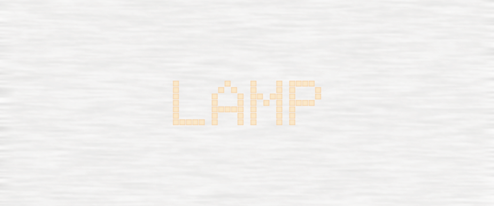

<picture>
  <source srcset="./cover_light.jpeg" media="(prefers-color-scheme: light), (prefers-color-scheme: no-preference)"/>
   <source srcset="./cover_dark.jpeg" media="(prefers-color-scheme: dark), (prefers-color-scheme: no-preference)"/>
  
</picture>

Lamp, an addon for Minecraft Bedrock/Pocket Edition, introduces various types of lamps into your world.

## Install

### General Steps

1. Download the latest `mc-lamp-addon.zip` on the release page.
2. Find the downloaded file.
   - On iOS and iPadOS, open `Files` (a built-in application by Apple) and the file is usually in your preferred `Downloads` folder.
   - On Android devices, open your device's file manager app (e.g., `Files` or `My Files`) and navigate to the "Downloads" folder or the location where you saved the `.mcpack` file.
3. Uncompress the zip file.
    - On iOS and iPadOS, click the zip file directly and it will create a new folder in which `behavior_pack.mcpack` and `resource_pack.mcpack` are enclosed.
    - On Android devices, you can uncompress the files using tools provided by your file manager.
4. Open the `.mcpack` File.
   - On iOS and iPadOS, click the mcpack files, and they will be automatically opened and imported into Minecraft.
   - On Android devices, you can:
      - Tap on the `.mcpack` file.
      - A prompt should appear, asking which app to use to open the file.
      - Select "Minecraft" from the list of apps.
      - Minecraft will launch automatically and begin importing the pack.
      - Once the import is complete, a confirmation message will appear, indicating successful installation.
5. For the current version (Minecraft v1.21.x), you need to enable casual creator options to ensure the functionality.
6. Enable both the behavior and resource pack for a specific world.

### Troubleshooting Steps

#### File Manager Compatibility

If tapping the `.mcpack` file doesn't prompt Minecraft to open, consider using a different file manager app.

#### Manual Installation

If the above method doesn't work, you can manually move the `.mcpack` file to the appropriate Minecraft folder:

- Use a file manager to navigate to the `.mcpack` file.
- Rename the `.mcpack` file extension to `.zip`.
- Extract the contents of the `.zip` file.
- Move the extracted folder to the `games/com.mojang/resource_packs` or `games/com.mojang/behavior_packs` directory, depending on the type of pack.
- Restart Minecraft and check if the pack appears in your settings.

## Lamps

### Caged Light Bulb

Comprising a wooden cage with a light bulb inside, it illuminates surroundings with light at level 15.

### Candle Lamp

Can emit 4 different levels of light (0, 5, 10, and 15), which is controlled by players' interaction (click).

### Desk Lamp

Is bistable and switchable via players' interaction (click).

### Fluorescent Lamp

Emits subtle, cold light that is perfect for a dark, tranquil room.

### Incandescent Light Bulb

Provides a warm, soft light that is ideal for creating cozy and inviting spaces in your Minecraft world.

### Light Tube

Offers a sleek and efficient lighting solution that can be used to create continuous lines of light, ideal for highlighting pathways or architectural features.

### Neon Lantern

Featuring dark frames and glass with excited gas inside the container, it caters to a warm, hospitable atmosphere.

### Polished Glowstone

### Redstone Signal Indicator

Displays up to 15 luminous slices and emits light levels based on the redstone power of adjacent blocks (up, down, north, east, south, and west) without requiring direct connections. When multiple redstone-powered blocks are detected, it adheres to the highest power level among them.

### RGB Lamp

Emits dynamic and colorful light at level 15.

### Toast Lamp

Designed to resemble a slice of toast, this whimsical lamp adds a playful touch to any room. It emits a warm, golden glow reminiscent of perfectly toasted bread.
